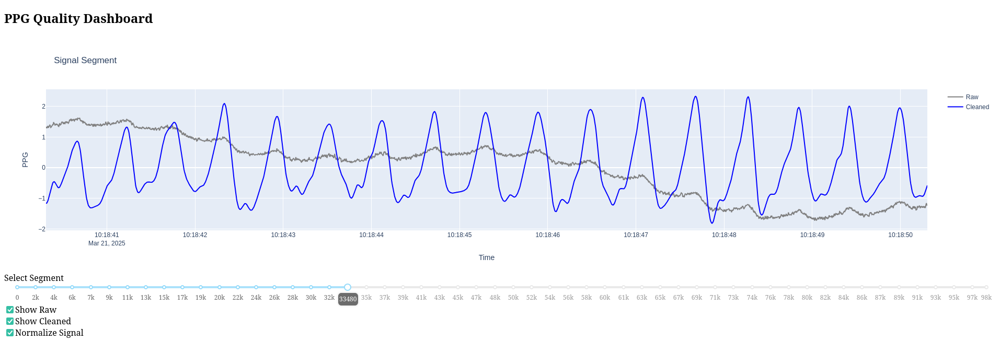
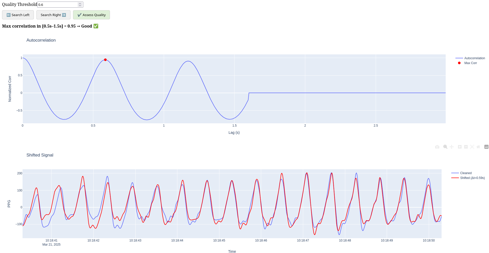
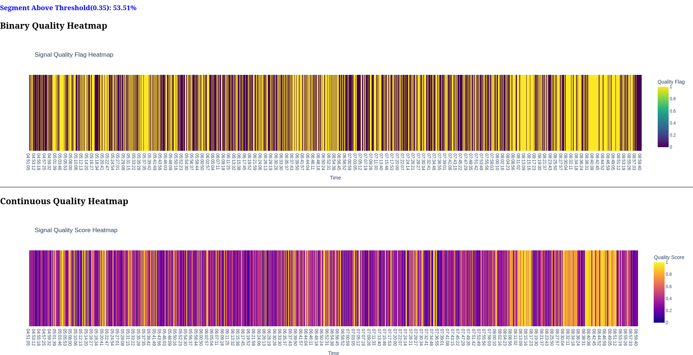
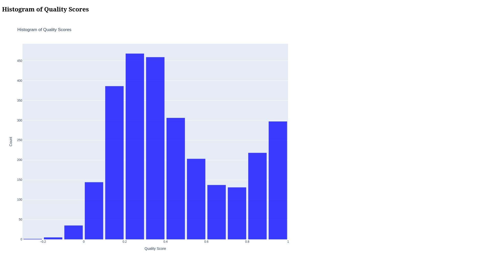
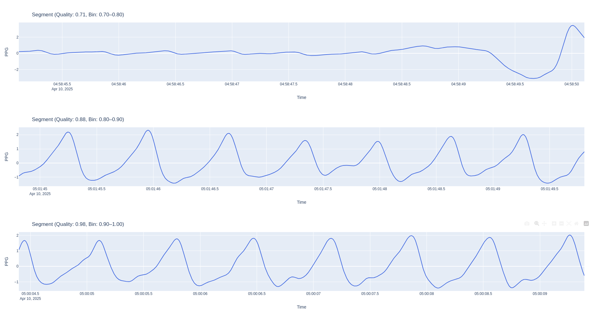

# BioSignal Quality Analysis

[](https://www.python.org/downloads/)
[](LICENSE)

A comprehensive toolkit for analyzing, visualizing, and evaluating the quality of physiological time series signals such as PPG (photoplethysmography) and ECG (electrocardiography).

## Screenshots

### DashBoard





### Report







## Features

- **Quality Assessment**: Evaluate quality using cross-correlation with shifted segments
- **Interactive Dashboard**: Visual exploration of signal segments with real-time quality metrics
- **Quality Reporting**: Generate comprehensive HTML reports with visualizations
- **Segment Processing**: Prepare and analyze segments with appropriate padding to avoid edge effects


## How It Works

The library assesses signal quality based on the periodicity of waveforms. For physiological signals like PPG and ECG, we expect a repetitive pattern corresponding to heart rate (typically 40-120 BPM or 0.5-1.5 seconds between peaks).

### Methodology:

1. **Segment Processing**: Signal is broken into segments of fixed duration
2. **Cleaning**: Signal is cleaned using specialized functions (e.g., `nk.ppg_clean()` for PPG data)
3. **Autocorrelation Analysis**: The cleaned signal is correlated with time-shifted versions of itself
4. **Quality Assessment**: Maximum correlation within the expected heart rate range determines quality
5. **Visual Feedback**: Interactive plots or reports show raw vs. cleaned signals and correlation patterns

## Installation

```bash
pip install pandas numpy plotly dash
pip install neurokit2  # For PPG/ECG signal processing
```

## Core Functions

The library provides three main functions:

### 1. `assess_quality`

Analyzes signal segments and returns a DataFrame with timestamps and quality scores.

```python
from biosignal_quality import assess_quality
import pandas as pd
import neurokit2 as nk

# Load your signal data
data = pd.read_csv("your_signal_data.csv")

# Get quality scores for each segment
quality_df = assess_quality(
    df=data,
    signal_col="ppg_signal",
    clean_func=nk.ppg_clean,
    sampling_rate=186,
    step_size_sec=1,
    segment_duration_sec=10
)

# Result includes timestamps and quality scores (0-1)
print(quality_df.head())
```

### 2. `assess_quality_percentage`

Provides an overall quality assessment with optional HTML report generation.

```python
from biosignal_quality import assess_quality_percentage
import neurokit2 as nk

# Get percentage of high-quality segments and generate HTML report
quality_percentage = assess_quality_percentage(
    df=data,
    signal_col="ecg_signal",
    clean_func=nk.ecg_clean,
    sampling_rate=250,
    quality_threshold=0.6,
    plot="ecg_quality_report.html"  # Optional: generate HTML report
)

print(f"Recording quality: {quality_percentage:.1f}% high-quality segments")
```

### 3. `signal_quality_dashboard`

Launches an interactive dashboard for exploring signal quality.

```python
from biosignal_quality import signal_quality_dashboard
import neurokit2 as nk

# Define optional normalization function
def zscore_normalize(signal):
    import numpy as np
    return (signal - np.mean(signal)) / np.std(signal)

# Launch interactive dashboard
signal_quality_dashboard(
    df=data,
    signal_col="ppg_signal",
    clean_func=nk.ppg_clean,
    normalize_func=zscore_normalize,
    signal_label="PPG",
    sampling_rate=186
)
```

## Parameter Reference

| Parameter | Description | Default |
|-----------|-------------|---------|
| `df` | DataFrame containing the signal with a 'time' column | - |
| `signal_col` | Column name containing the signal | - |
| `clean_func` | Function to clean the signal (e.g., nk.ppg_clean) | - |
| `signal_label` | Label for the signal in visualizations | "Signal" |
| `normalize_func` | Optional function to normalize signals | None |
| `sampling_rate` | Sampling rate in Hz | 186 |
| `segment_duration_sec` | Duration of segment in seconds | 10 |
| `step_size_sec` | Step size between segments for assessment | 1 |
| `quality_lag_low` | Lower bound for quality assessment lag (seconds) | 0.5 |
| `quality_lag_high` | Upper bound for quality assessment lag (seconds) | 1.5 |
| `quality_threshold` | Threshold for determining high-quality segments | 0.6 |
| `max_lag_sec` | Maximum lag in seconds for autocorrelation | 3 |
| `clean_padding_ratio` | Ratio of padding to add before cleaning | 0.2 |
| `delta_padding_sec` | Additional padding in seconds for extended segment | 1.6 |
| `plot` | Path to save HTML report (for assess_quality_percentage) | None |
| `bin_size` | Bin size for quality score histogram in report | 0.1 |
| `num_plots_bin` | Number of example segments to plot per quality bin | 1 |
| `launch_dashboard` | Whether to launch interactive dashboard | False |
| `verbose` | Whether to print progress information | False |

## Example: Complete Analysis Workflow

```python
import pandas as pd
import numpy as np
import neurokit2 as nk
from biosignal_quality import assess_quality, assess_quality_percentage, signal_quality_dashboard

# Load data
data = pd.read_csv("ppg_recording.csv")

# Define normalization function
def zscore_normalize(signal):
    return (signal - np.mean(signal)) / np.std(signal)

# Step 1: Get quick overall quality assessment with report
quality_pct = assess_quality_percentage(
    df=data,
    signal_col="ppg",
    clean_func=nk.ppg_clean,
    sampling_rate=186,
    quality_threshold=0.6,
    plot="quality_report.html",
    signal_label="PPG"
)
print(f"Overall signal quality: {quality_pct:.1f}%")

# Step 2: Get detailed quality scores for each segment
quality_df = assess_quality(
    df=data,
    signal_col="ppg",
    clean_func=nk.ppg_clean,
    sampling_rate=186,
    step_size_sec=1
)

# Step 3: Find segments with best and worst quality
best_segments = quality_df.nlargest(5, 'quality_score')
worst_segments = quality_df.nsmallest(5, 'quality_score')

# Step 4: Launch interactive dashboard to explore specific segments
signal_quality_dashboard(
    df=data,
    signal_col="ppg",
    clean_func=nk.ppg_clean,
    normalize_func=zscore_normalize,
    sampling_rate=186,
    signal_label="PPG"
)
```

## HTML Report Contents

When generating a quality report using `assess_quality_percentage` with the `plot` parameter, the HTML report includes:

- **Summary Statistics**: Overall quality percentage and distribution
- **Quality Timeline**: Heatmap showing quality scores over time
- **Quality Histogram**: Distribution of quality scores
- **Example Segments**: Representative segments for different quality levels
- **Autocorrelation Plots**: Correlation patterns for selected segments

## Dashboard Controls

The interactive dashboard provided by `signal_quality_dashboard()` includes:

- **Segment Navigation**: Navigate through signal segments
- **Raw/Cleaned Signal Toggle**: Compare raw and processed signals
- **Normalization Option**: Apply normalization to the displayed signals
- **Quality Threshold Adjustment**: Set the correlation threshold for "good" quality
- **Quality Search**: Find segments meeting the quality threshold criteria
- **Auto-correlation Analysis**: Visualize signal periodicity at different lags


## License

MIT License